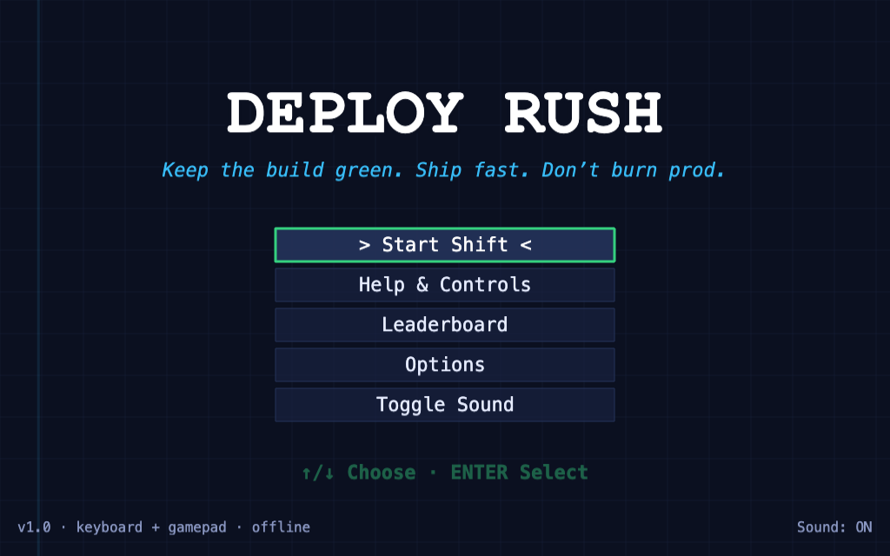
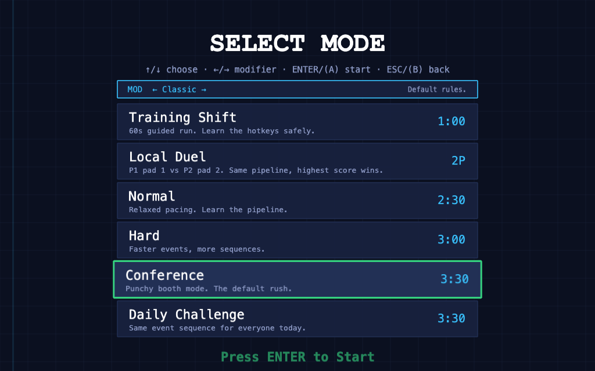
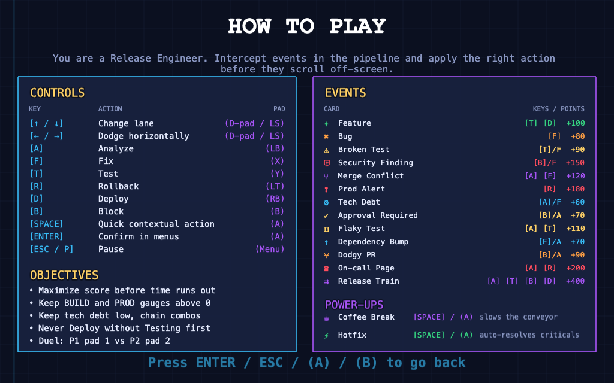
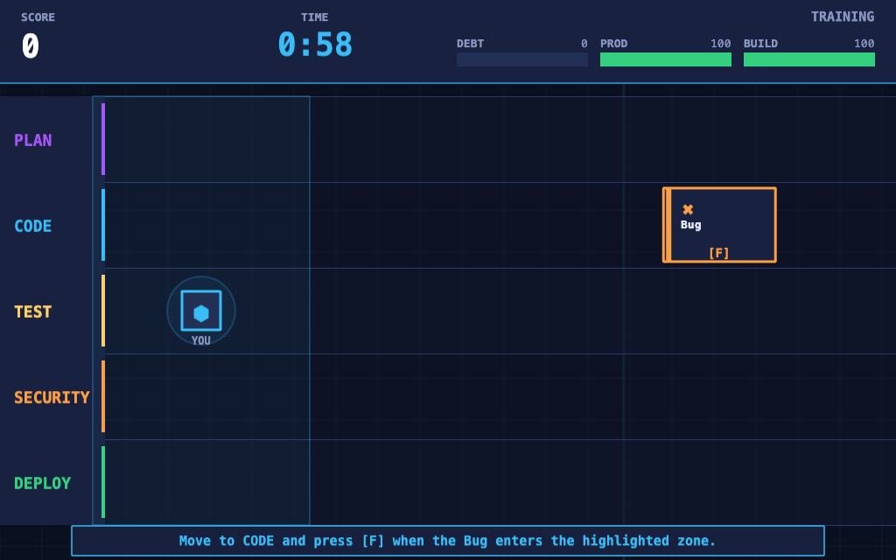
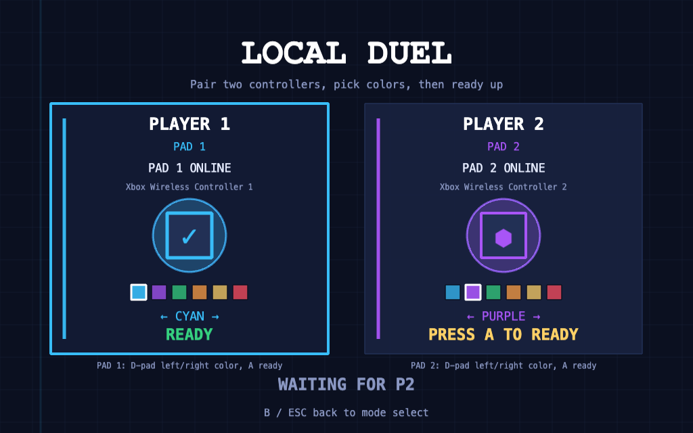
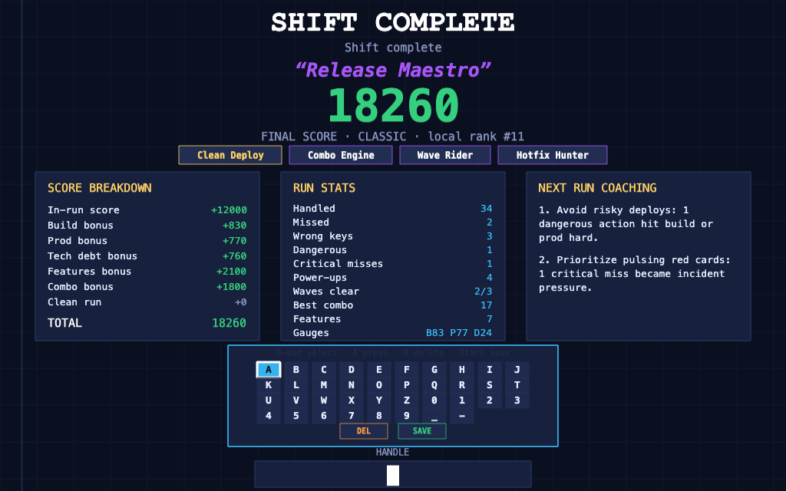
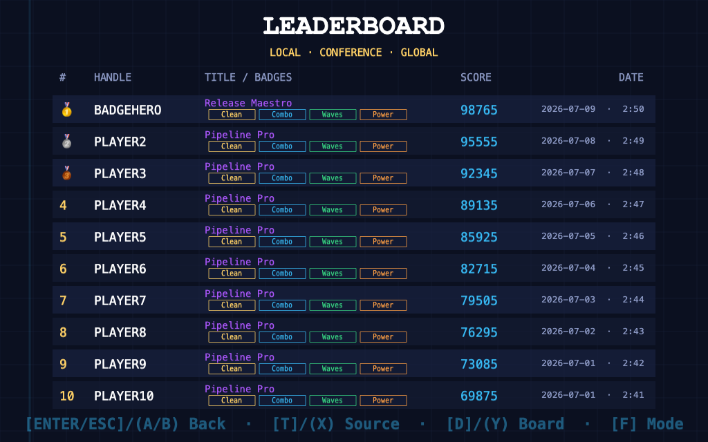
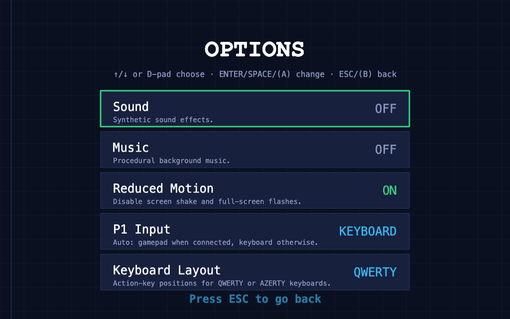

# Deploy Rush Player Manual

> Keep the build green. Ship fast. Don't burn prod.

**Deploy Rush** is an arcade game about being a Release Engineer inside a live
CI/CD pipeline. Software events move from right to left across five pipeline
lanes. Move into the right lane, catch each event in the highlighted processing
zone, and press the correct action before the card escapes.



Built with **Phaser 3 + TypeScript + Vite**. It runs fully offline by default,
with an optional online leaderboard backend.

## Start Playing

```bash
npm install
npm run dev
```

Open the Vite URL, usually <http://localhost:5173/>.

Other useful commands:

```bash
npm run build      # type-check + production build into dist/
npm run preview    # serve the production build
npm run typecheck  # TypeScript check only
npm test           # run unit tests
```

Requirements: Node 18+.

## Screen Tour

### Main Menu

Use the menu to start a shift, open this in-game help screen, view the
leaderboard, change options, or toggle sound.

Controls: `Up` / `Down` or D-pad / left stick to move, then `Enter` or gamepad
`A` to confirm.


### Mode Select

Choose the run type. On solo score runs, `Left` / `Right` cycles optional run
modifiers.



### How To Play

The in-game help screen lists controls, objectives, event cards, action labels,
point values, and power-ups.



### Gameplay

Your player token sits inside the left processing zone. Cards spawn on the
right and move left. When a card is aligned with your lane and inside the
processing zone, press the next required action.



### Local Duel Lobby

Local Duel uses two controllers. Each player picks a color and readies up on
their own pad.



### Game Over

The results screen shows your final score, title, badges, score breakdown, run
stats, coaching tips, and handle entry. With a gamepad connected, a virtual
keyboard appears.



### Leaderboard

Leaderboard rows show the handle, title, earned run badges, score, and date.
The screen supports online/global, online/daily, and local/offline boards.



### Options

Options persist in `localStorage` and cover sound, music, reduced motion,
keyboard layout, and the effective P1 input device.



## Core Goal

Survive the shift and maximize your score.

- Handle cards correctly to gain points.
- Chain correct actions to build a combo multiplier.
- Keep **Build** and **Prod** above zero.
- Keep **Tech Debt** low, because high debt makes the pipeline faster.
- Clear critical incidents before they become expensive misses.
- Use power-ups to stabilize crowded moments.

The run ends when the timer reaches zero, when Build hits zero, or when Prod
hits zero.

## Pipeline Lanes

Events move through five lanes:

`PLAN` -> `CODE` -> `TEST` -> `SECURITY` -> `DEPLOY`

Each card has a natural lane. As difficulty rises, cards can spawn off-lane or
drift toward a neighboring lane. Stay mobile.

## Controls

### Navigation

| Action | Keyboard | Xbox-style gamepad |
| --- | --- | --- |
| Move lane | `Up` / `Down` | D-pad / left stick |
| Dodge horizontally | `Left` / `Right` | D-pad / left stick |
| Confirm in menus | `Enter` | `A` |
| Back in menus | `Esc` | `B` |
| Pause / resume | `Esc` / `P` | Menu / Start |

### Card Actions

| Action | Keyboard | Gamepad | Typical use |
| --- | --- | --- | --- |
| Analyze | `A` | `LB` | Inspect tech debt, conflicts, on-call pages |
| Fix | `F` | `X` | Fix bugs, tests, dependencies |
| Test | `T` | `Y` | Validate features and flaky tests |
| Rollback | `R` | `LT` | Recover production alerts |
| Deploy | `D` | `RB` / `RT` | Ship validated work |
| Block | `B` | `B` | Stop risky/security work |
| Quick contextual action | `Space` | `A` | Perform the next required step on the aligned card |

When at least one gamepad is connected, P1 automatically uses the first
connected pad and card labels switch to gamepad buttons. Without a gamepad,
solo play uses keyboard labels.

## Game Modes

| Mode | Duration | Description |
| --- | ---: | --- |
| Training Shift | 1:00 | Guided scripted run for learning movement and hotkeys. |
| Local Duel | 2:00 | Same-screen 1v1. P1 uses pad 1, P2 uses pad 2. |
| Normal | 2:30 | Relaxed pacing for learning the pipeline. |
| Hard | 3:00 | Faster events and more sequences. |
| Conference | 3:30 | Punchy booth mode and the default score run. |
| Daily Challenge | 3:30 | Conference rules with today's deterministic event seed. |

Training, Daily Challenge, and Local Duel use fixed rules. Normal, Hard, and
Conference can use optional modifiers.

## Run Modifiers

Cycle modifiers on the mode select screen with `Left` / `Right`.

| Modifier | What changes |
| --- | --- |
| Classic | Default rules. |
| Fast Pipeline | Faster conveyor and spawns, with a score multiplier. |
| Fragile Prod | Production starts lower and mistakes hurt more. |
| Tech Debt Surge | You begin with tech debt and extra spawn pressure. |
| Precision Run | Higher score potential, but mistakes are punishing. |

Modified solo runs are saved in separate local leaderboard scopes and are not
submitted to the online classic leaderboard.

## Event Cards

Cards may require one action or a sequence. For multi-step cards, complete the
steps in order. `Space` / gamepad `A` performs the next required step when you
are aligned with the card.

| Event | Lane | Required action | Notes |
| --- | --- | --- | --- |
| Feature | DEPLOY | `T` then `D` | Test before deploy. Deploying early is dangerous. |
| Bug | CODE | `F` | Misses hurt production. |
| Broken Test | TEST | `T` or `F` | Stabilizes build when handled. |
| Security Finding | SECURITY | `B` or `F` | Critical. Misses damage production and reset combo. |
| Merge Conflict | CODE | `A` then `F` | Analyze first, then fix. |
| Prod Alert | DEPLOY | `R` | Critical. Roll it back fast. |
| Tech Debt | PLAN | `A` or `F` | Ignoring it increases tech debt. |
| Approval Required | SECURITY | `B` or `A` | Pressing deploy is dangerous. |
| Flaky Test | TEST | `A` then `T` | Analyze, then test. |
| Dependency Bump | CODE | `F` or `A` | Good target for debt control. |
| Dodgy PR | CODE | `B` or `A` | Pressing deploy is dangerous. |
| On-call Page | DEPLOY | `A` then `R` | Critical production recovery. |
| Release Train | varies | `A`, `T`, `B`, `D` | Mega wave card. Jumps lanes after each step. |

Critical cards pulse red. Ignoring them is costly.

## Incident Waves

During longer runs, incident waves create boss-like moments. A warning appears
before the wave lands.

- **Incident Burst** spreads critical cards across multiple lanes.
- **Storm** floods one lane with repeated bugs or tests.
- **Release Train** creates a large chained card that jumps lanes after every
  completed step.

Waves are deterministic for daily runs and are suppressed in the final stretch
so the ending remains fair.

## Power-Ups

Power-ups are collected like cards: line up and press `Space` / gamepad `A`.

| Pickup | Effect |
| --- | --- |
| Coffee Break | Slows the conveyor for a few seconds. |
| Hotfix | Auto-resolves every critical card currently on screen. |

## Scoring

Your HUD shows:

- Score
- Combo and combo multiplier
- Timer
- Tech Debt
- Production health
- Build stability

Correct actions add points. Positive points are multiplied by the current combo
multiplier, from x1 up to x5. Every four successful actions raises the combo
tier. Wrong actions reset the combo. Critical misses also reset it.

End-of-run bonuses:

| Bonus | Formula |
| --- | --- |
| Build bonus | `buildStability * 4` |
| Production bonus | `productionHealth * 4` |
| Tech debt bonus | `(100 - techDebt) * 2` |
| Features bonus | `featuresShipped * 40` |
| Combo bonus | `bestCombo * 10` |
| Clean run bonus | `+500` if no major incident and both gauges survived |

The result screen also awards a title and compact run badges. Badges highlight
play patterns such as clean deploys, long combos, wave control, low tech debt,
precise inputs, strong production health, and power-up usage.

## Local Duel

Local Duel is a same-screen 1v1 mode for two controllers.

- P1 is bound to gamepad 1.
- P2 is bound to gamepad 2.
- Both players race for the same cards.
- The player who completes a card gets the points.
- Ignored cards penalize both players.
- Target markers show whether P1, P2, or both players are aligned with a card.
- Highest score wins when the timer ends.

The duel end screen compares both players: score gap, combos, mistakes,
incidents, power-ups, and stolen cards.

## Leaderboards

After a solo run, enter a handle and save your score.

- Scores are always saved locally in browser `localStorage`.
- If the optional backend is running, classic eligible scores are also submitted
  online.
- Training and modified runs stay local.
- Daily scores are scoped by the date seed.

Leaderboard controls:

| Control | Effect |
| --- | --- |
| `T` / gamepad `X` | Toggle online/local source. |
| `D` / gamepad `Y` | Toggle global/daily board. |
| `F` | Cycle local mode scope. |
| `Enter` / `A` | Replay or go back, depending on entry point. |
| `M` / `B` | Back to menu after a game-over leaderboard. |

If the backend is unreachable, the game automatically falls back to the local
board.

## Options

| Option | Description |
| --- | --- |
| Sound | Enables/disables synthetic sound effects. |
| Music | Enables/disables procedural background music. |
| Reduced Motion | Removes screen shake and full-screen flashes while keeping core feedback. |
| P1 Input | Auto-detected: any connected gamepad forces gamepad mode; otherwise keyboard. |
| Keyboard Layout | Chooses QWERTY or AZERTY action-key positions. |

Settings are stored per browser in `deploy-rush.settings.v1`.

## Optional Online Leaderboard Backend

The optional Express backend provides global and daily online leaderboards. The
game works without it.

```bash
npm run server:install   # one-time backend dependency install
npm run server           # start API on http://localhost:8787
```

Run it in a second terminal alongside `npm run dev`. Vite proxies `/api` to the
backend automatically. Override the target with `VITE_API_TARGET` if needed.

API overview:

| Method and path | Purpose |
| --- | --- |
| `GET /api/health` | Health check. |
| `GET /api/leaderboard/global?limit=10` | Global top scores. |
| `GET /api/leaderboard/daily?seed=YYYYMMDD` | Daily board for one seed. |
| `POST /api/scores` | Submit a validated score and badges. |

The backend includes helmet security headers, CORS allowlisting, rate limiting,
optional submit-token auth, handle moderation, anti-cheat validation, and salted
IP hashing.

## Docker

Run the game and backend together:

```bash
docker compose up --build
```

- Game: <http://localhost:8080>
- API through nginx: <http://localhost:8080/api>
- Direct API: <http://localhost:8787>

Scores persist in the `leaderboard-data` Docker volume.

Optional hardening example:

```bash
SUBMIT_TOKEN=change-me VITE_SUBMIT_TOKEN=change-me \
ALLOWED_ORIGINS=http://localhost:8080 \
docker compose up --build
```

Stop with:

```bash
docker compose down
```

Add `-v` to also remove the leaderboard volume.

## Developer Notes

Useful tuning files:

- `src/game/data/eventDefinitions.ts` controls event balance, points, actions,
  penalties, and spawn weights.
- `src/game/data/difficultyProfiles.ts` controls match length, pacing, speed,
  ramping, and sequence pressure.
- `src/game/data/runModifiers.ts` controls optional solo score-run modifiers.
- `src/game/constants.ts` controls canvas size, colors, lanes, gauges, key
  labels, and layout constants.

Main scene files:

- `MenuScene.ts`
- `HelpScene.ts`
- `DifficultySelectScene.ts`
- `OptionsScene.ts`
- `GameScene.ts`
- `VersusLobbyScene.ts`
- `VersusScene.ts`
- `GameOverScene.ts`
- `LeaderboardScene.ts`

See [GAME_DESIGN.md](GAME_DESIGN.md) for deeper design rationale and balancing
notes.

## Known Limitations

- Online anti-cheat is heuristic, not cryptographic proof of play.
- Local settings and local scores are per browser.
- Sound and music are intentionally asset-free and synthetic.
- Local Duel requires two connected controllers.

## License

MIT.
